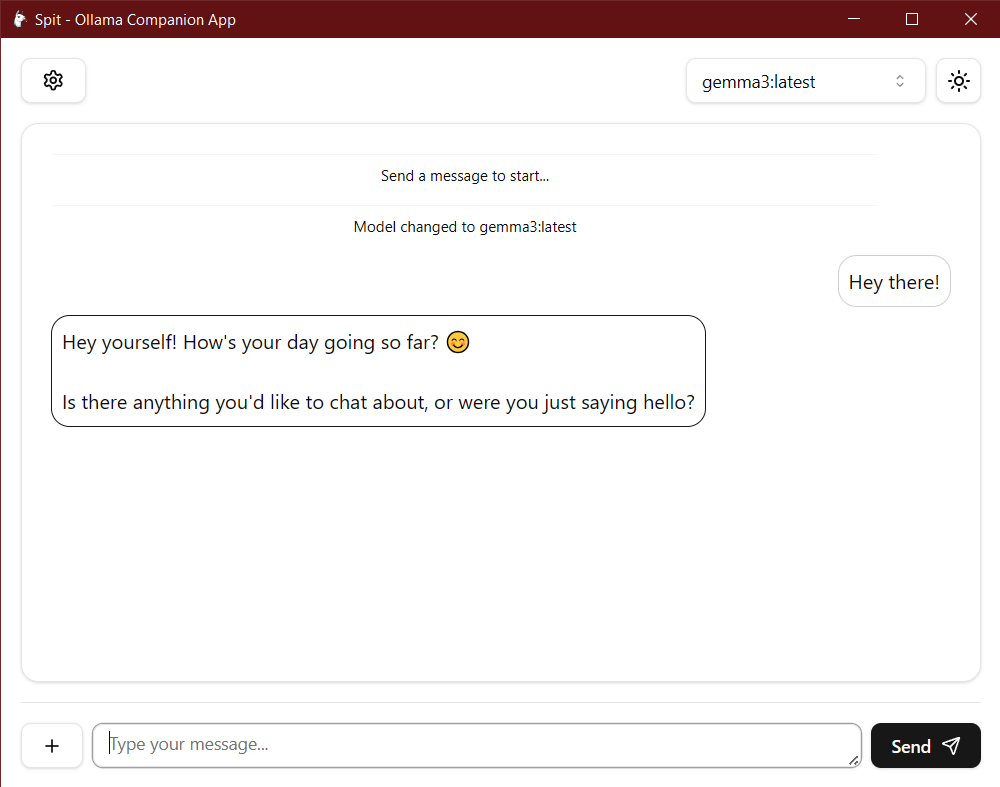
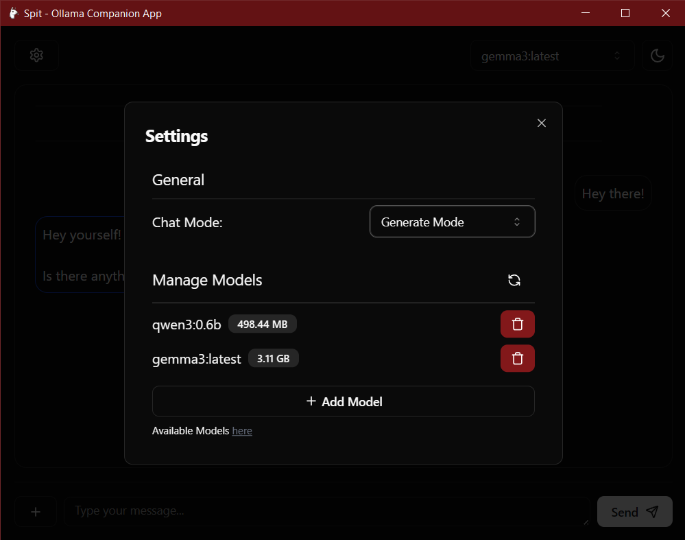

# Spit - Ollama Companion

*🔥 Sometimes the lama spits out some good stuff! 🔥*

## What is Spit?

Spit is a lightweight desktop application designed to enhance your experience with [Ollama](https://ollama.com/),
a powerful tool for running large language models (LLMs) locally.
It provides a user-friendly interface for interacting with Ollama's models, allowing you to easily send prompts and
receive responses without the need for cli usage.

### Features

- [x] **Model Management**: View, pull, and delete models from Ollama.
- [x] **Prompting**: Send prompts to models and receive responses.
- [x] **DarkMode**: Because that's what's really important.
- [x] **Image Attachment**: Models that support visual inputs can receive images as part of the prompt.

### Screentshots

## References

- [React](https://react.dev/)
- [TypeScript](https://www.typescriptlang.org/)
- [Tailwind CSS](https://tailwindcss.com/)
- [Shadcn UI](https://ui.shadcn.com/)
- [Tauri](https://tauri.app/)
- [Rust](https://www.rust-lang.org/)
- [Ollama](https://ollama.com/)
- [ollama-rs](https://github.com/pepperoni21/ollama-rs)
